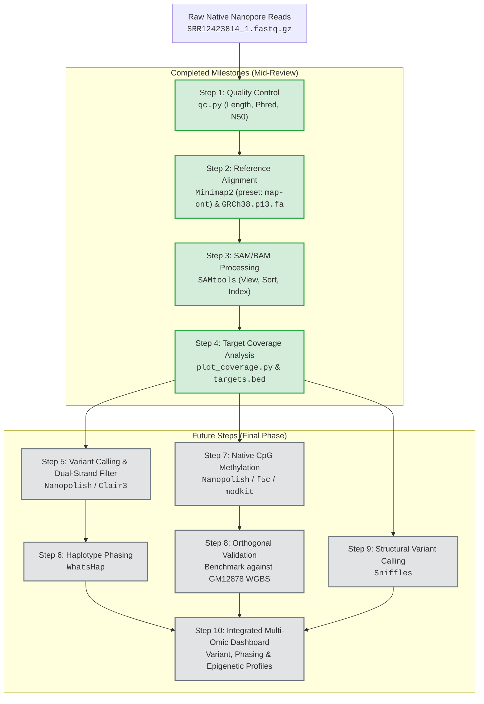

# Targeted Genomic Region and Epigenetic Analysis Using Oxford Nanopore Sequencing

[](https://nanoporetech.com/)
[](https://www.ncbi.nlm.nih.gov/assembly/GCF_000001405.39)
[](https://www.ncbi.nlm.nih.gov/sra/SRR12423814)
[]()

---

## 📌 Project Overview

This project implements an end-to-end computational genomics and epigenomics pipeline for analyzing **targeted native Oxford Nanopore sequencing (nCATS)** data. By combining CRISPR-Cas9 targeted cleavage with adapter ligation on unamplified native DNA, nCATS enables high-coverage interrogation of specific human genomic regions while preserving native base modifications and long-read structural continuity.

The pipeline is benchmarked on the reference human cell line **NA12878 / GM12878** (NCBI SRA: `SRR12423814`, BioProject `PRJNA656260`), targeting 10 critical human genomic loci.

---

## 🎯 Objectives

1. **Comprehensive Quality Assessment**: Evaluate read length, Phred quality score distributions, throughput, and N50 metrics for raw long-read FASTQ data.
2. **High-Accuracy Reference Alignment**: Align native reads against the human reference genome (`GRCh38.p13` / `hg38`) using `Minimap2` and process alignments with `SAMtools`.
3. **On-Target & Coverage Characterization**: Quantify sequencing depth, coverage breadth, and on-target efficiency across 10 target loci.
4. **Strand-Specific Variant Calling & Filtering**: Identify single-nucleotide variants (SNVs) and small indels using Nanopore-tailored algorithms (`Nanopolish` / `Clair3`) with forward/reverse dual-strand consistency filtering.
5. **Long-Read Haplotype Phasing**: Leverage single-molecule spanning reads to reconstruct contiguous haplotype blocks using `WhatsHap`.
6. **Native CpG Methylation Profiling**: Call 5-methylcytosine (5mC) modifications directly from native reads without bisulfite degradation and validate against orthogonal Whole-Genome Bisulfite Sequencing (WGBS).
7. **Structural Variant (SV) Detection & Multi-Omic Integration**: Detect long-read supported structural variations (`Sniffles`) and generate unified genomic-epigenetic target profiles.

---

## 🧬 Dataset Details

| Parameter | Specification |
| :--- | :--- |
| **Sample** | Human NA12878 / GM12878 (Utah CEPH reference lymphoblastoid line) |
| **Database** | NCBI Sequence Read Archive (SRA) |
| **BioProject** | `PRJNA656260` |
| **SRA Run Accession** | `SRR12423814` |
| **Sequencing Platform** | Oxford Nanopore MinION (R9.4.1 flow cell) |
| **Assay Type** | Nanopore Cas9-Targeted Sequencing (nCATS, native DNA) |
| **Input File** | `SRR12423814_1.fastq.gz` (compressed size ~63.0 MB) |
| **Reference Genome** | Human Genome Assembly `GRCh38.p13` / `GCF_000001405.39` |

### 🎯 Target Genomic Regions (10 Loci)

| Target ID | Chromosome Coordinates (GRCh38) | Associated Locus / Marker | Description / Biological Relevance |
| :---: | :---: | :---: | :--- |
| **T1** | `chr15:27,983,281–27,993,166` | `rs1800407` (OCA2) | Pigmentation & iris color trait locus |
| **T2** | `chr15:28,112,702–28,130,250` | `rs12913832` (HERC2/OCA2) | Major regulatory locus for eye/hair color |
| **T3** | `chr14:92,303,403–92,323,757` | `rs12896399` (SLC24A4) | Hair & skin pigmentation marker |
| **T4** | `chr5:33,944,711–33,959,555` | `rs16891982` (SLC45A2) | Melanoma risk & pigmentation variant |
| **T5** | `chr11:89,259,000–89,295,942` | `rs1393350` (TYR) | Tyrosinase gene / albinism locus |
| **T6** | `chr6:392,229–401,463` | `rs12203592` (IRF4) | Interferon regulatory factor / skin phenotype |
| **T7** | `chr2:1,480,364–1,494,141` | `TPOX` | Short Tandem Repeat (STR) forensic marker |
| **T8** | `chr21:43,627,563–43,644,088` | `PentaD` | Pentanucleotide STR locus on Chr 21 |
| **T9** | `chr1:159,199,781–159,212,236` | `rs2814778` (ACKR1/CADM3) | Duffy blood group / malaria resistance marker |
| **T10** | `chr4:99,314,773–99,323,024` | `rs1229984` (ADH1B) | Alcohol dehydrogenase variant / metabolic locus |

---

## 🏗️ Computational Methodology & Pipeline Architecture



---

## 📊 Current Progress & Results

### 1. Quality Control Metrics (`qc.py`)

The raw Nanopore sequencing dataset was evaluated using custom streaming statistics and Phred+33 ASCII decoding:

| Metric | Measured Value | Biological / Technical Interpretation |
| :--- | :---: | :--- |
| **Total Read Count** | **23,305** | Sufficient target depth for targeted assay |
| **Total Base Output** | **62,676,680 bp (62.68 Mb)** | High cumulative yield on MinION |
| **Mean Read Length** | **2,689.41 bp** | Typical for Cas9-cleaved enriched fragments |
| **Median Read Length** | **935.00 bp** | Distribution includes short off-target & full on-target cuts |
| **N50 Read Length** | **7,521 bp** | 50% of sequenced bases reside in reads $\ge$ 7.5 kb |
| **Maximum Read Length** | **58,909 bp (~58.9 kb)** | Highlights long single-molecule spanning capability |
| **Mean Phred Quality** | **Q19.40 (98.85% accuracy)** | High quality for R9.4.1 native reads |
| **Median Phred Quality** | **Q19.91 (~99.0% accuracy)** | High-confidence basecalling |

*Generated Visualizations:*
- Read Length Distribution: `results/qc/read_length_distribution.png`
- Quality Distribution: `results/qc/quality_distribution.png`

---

### 2. Alignment & Target Coverage Analysis (`plot_coverage.py`)

Alignments to human reference genome `GRCh38.p13` were generated via `Minimap2` and indexed via `SAMtools`. Coverage statistics across the 10 target regions in `results/coverage/target_coverage.tsv`:

| Target ID | Genomic Region | Size (bp) | Read Count | Covered Bases | Coverage Breadth (%) | Mean Depth (×) | Mean Base Q | Mean Map Q |
| :---: | :--- | :---: | :---: | :---: | :---: | :---: | :---: | :---: |
| **T1** | `chr15:27983281-27993166` | 9,886 | 1,694 | 9,886 | **100.00%** | **72.98×** | 20.3 | 14.6 |
| **T2** | `chr15:28112702-28130250` | 17,549 | 679 | 17,532 | **99.90%** | **20.21×** | 19.5 | 12.2 |
| **T3** | `chr14:92303403-92323757` | 20,355 | 908 | 20,329 | **99.87%** | **16.88×** | 20.3 | 13.4 |
| **T4** | `chr5:33944711-33959555` | 14,845 | 753 | 14,828 | **99.89%** | **47.35×** | 20.4 | 47.5 |
| **T5** | `chr11:89259000-89295942` | 36,943 | 1,038 | 36,913 | **99.92%** | **16.15×** | 21.5 | 15.6 |
| **T6** | `chr6:392229-401463` | 9,235 | 30 | 9,221 | **99.85%** | **17.28×** | 19.4 | 58.2 |
| **T7** | `chr2:1480364-1494141` | 13,778 | 2,682 | 13,778 | **100.00%** | **99.09×** | 20.5 | 19.6 |
| **T8** | `chr21:43627563-43644088` | 16,526 | 3,431 | 16,510 | **99.90%** | **84.04×** | 20.8 | 16.3 |
| **T9** | `chr1:159199781-159212236` | 12,456 | 1,201 | 12,440 | **99.87%** | **60.51×** | 19.7 | 16.3 |
| **T10** | `chr4:99314773-99323024` | 8,252 | 86 | 8,240 | **99.85%** | **52.02×** | 20.1 | 59.0 |

> **Key Finding**: Every target region achieved **>99.8% breadth of coverage**, with mean sequencing depths reaching up to **99.09×** (T7 - TPOX) and **84.04×** (T8 - PentaD), validating the high efficiency of Cas9-targeted enrichment.

*Generated Visualizations:*
- Mean Sequencing Depth: `results/coverage/mean_depth.png`
- Coverage Breadth: `results/coverage/coverage_breadth.png`

---

## 🌟 Novelty & Key Advantages

1. **Native Epigenetic Preservation**: Unlike bisulfite sequencing (which damages >90% of template DNA and converts unmethylated cytosines to uracil), native Nanopore reads detect 5mC directly from raw ionic current signals.
2. **PCR-Free Target Enrichment**: Eliminates amplification bias, GC dropout, and polymerase-induced errors.
3. **Dual-Strand High-Confidence Filtering**: Cas9 cleaves and leaves adapters preferentially on the 3' end. Comparing forward-strand, reverse-strand, and paired reads suppresses single-strand artifacts.
4. **Long-Range Haplotype Phasing**: Long reads span multiple heterozygous SNVs across entire gene spans (e.g. 10–37 kb targets), resolving maternal and paternal haplotypes directly.
5. **Simultaneous Multi-Omic Characterization**: A single assay captures SNVs, structural variants, short tandem repeats (STRs), and epigenetic modification profiles.

---

## 🛠️ Software & Tools Stack

| Category | Tool | Version / Library | Purpose |
| :--- | :--- | :--- | :--- |
| **Language & Scripts** | Python | 3.10+ | Data parsing, streaming QC, plotting |
| **Data Analysis** | Pandas / NumPy / SciPy | Latest | Tabular data manipulation & statistical correlation |
| **Visualization** | Matplotlib / Seaborn | Latest | Publication-quality QC and coverage plots |
| **Alignment** | `minimap2` | 2.24+ (`map-ont`) | Fast, accurate long-read alignment to GRCh38 |
| **Alignment Processing**| `samtools` | 1.15+ | BAM sorting, indexing, depth & coverage extraction |
| **Variant Calling** | `Nanopolish` / `Clair3` | Planned | Accurate SNV & indel detection on long reads |
| **Phasing** | `WhatsHap` | Planned | Read-backed long-read haplotype phasing |
| **Methylation Calling** | `Nanopolish` / `modkit` / `f5c` | Planned | Direct CpG 5mC methylation calling |
| **Structural Variants** | `Sniffles2` | Planned | Complex SV detection & breakpoint resolution |

---

## 🚀 Execution & Reproducibility Guide

### 1. Environment Setup
```bash
# Clone repository and navigate to workspace
cd d:\DNA

# Install Python requirements
pip install pandas matplotlib numpy scipy seaborn
```

### 2. Run Quality Control
```bash
python qc.py
# Outputs:
# - Summary printed to console (N50, Read count, Mean Q)
# - results/qc/read_length_distribution.png
# - results/qc/quality_distribution.png
```

### 3. Generate Coverage & Depth Plots
```bash
python plot_coverage.py
# Outputs:
# - results/coverage/mean_depth.png
# - results/coverage/coverage_breadth.png
```

---

## 🔮 Future Roadmap (Final Phase Deliverables)

- [x] **Milestone 1**: Data acquisition & FASTQ QC validation.
- [x] **Milestone 2**: Reference genome indexing, alignment, BAM processing.
- [x] **Milestone 3**: Target region coverage breadth and depth evaluation.
- [ ] **Milestone 4**: High-confidence variant calling with strand-specific dual-filtering.
- [ ] **Milestone 5**: Long-read haplotype phasing using WhatsHap.
- [ ] **Milestone 6**: Native CpG methylation estimation and statistical benchmarking against GM12878 WGBS data.
- [ ] **Milestone 7**: Structural variant identification using Sniffles2.
- [ ] **Milestone 8**: Consolidated multi-omic target summary report & final presentation.

---

## 📚 References

1. Gilpatrick, T., Lee, I., Graham, J. E., et al. (2020). *Targeted nanopore sequencing with Cas9-guided adapter ligation*. **Nature Biotechnology**, 38(4), 433–438.
2. Martin, M., et al. (2016). *WhatsHap: fast and accurate read-backed phasing*. **bioRxiv**.
3. Simpson, J. T., et al. (2017). *Detecting DNA cytosine methylation using nanopore sequencing*. **Nature Methods**, 14(4), 407–410.
4. Li, H. (2018). *Minimap2: pairwise alignment for nucleotide sequences*. **Bioinformatics**, 34(18), 3094–3100.
