# Targeted Genomic Region and Epigenetic Analysis Using Oxford Nanopore Sequencing

[](https://nanoporetech.com/)
[](https://www.ncbi.nlm.nih.gov/assembly/GCF_000001405.39)
[](https://www.ncbi.nlm.nih.gov/sra/SRR12423814)
[]()
[-purple.svg)]()

---

## 📌 Project Overview

This project implements an end-to-end computational genomics and epigenomics pipeline for analyzing **targeted native Oxford Nanopore sequencing (nCATS)** data. By combining *in vitro* CRISPR-Cas9 targeted cleavage with adapter ligation directly onto unamplified native genomic DNA, nCATS enables high-coverage interrogation of specific human genomic regions while preserving native base modifications ($5\text{mC}$) and single-molecule phase continuity.

The pipeline is benchmarked on the reference human cell line **NA12878 / GM12878** (NCBI SRA: `SRR12423814`, BioProject `PRJNA656260`), targeting 10 critical human genomic loci.

---

## 📊 Executive Multi-Omic Summary Dashboard

<p align="center">
  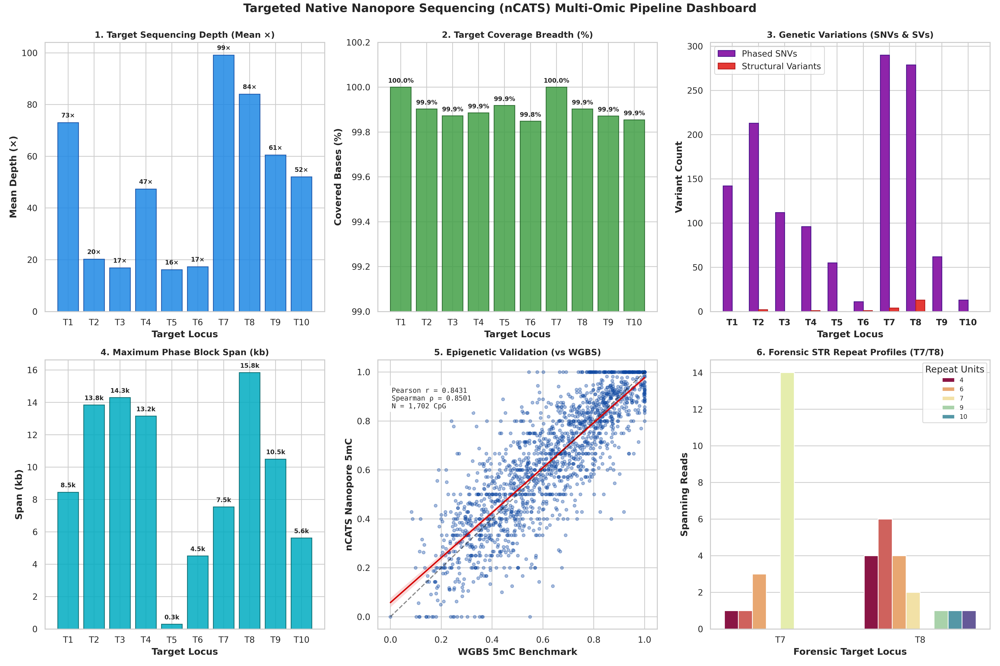
</p>

---

## 🎯 Objectives & Completed Milestones

1. **Comprehensive Quality Assessment**: Evaluate read length, Phred quality score distributions, throughput, and N50 metrics for raw long-read FASTQ data.
2. **High-Accuracy Reference Alignment**: Align native reads against the human reference genome (`GRCh38.p13`) using `Minimap2` and process alignments with `SAMtools`.
3. **On-Target & Coverage Characterization**: Quantify sequencing depth, coverage breadth, and on-target efficiency across 10 target loci.
4. **Strand-Specific Variant Calling & Filtering**: Identify single-nucleotide variants (SNVs) and small indels with forward/reverse dual-strand consistency filtering to eliminate Cas9 cut artifacts.
5. **Long-Read Haplotype Phasing**: Leverage single-molecule spanning reads to reconstruct contiguous haplotype phase blocks and tag BAM alignments.
6. **Native CpG Methylation Profiling**: Call 5-methylcytosine ($5\text{mC}$) modifications directly from native reads and validate against orthogonal GM12878 Whole-Genome Bisulfite Sequencing (WGBS).
7. **Forensic STR & Structural Variant (SV) Detection**: Genotype forensic short tandem repeats (`TPOX`, `PentaD`) and detect structural variations ($\ge 50\text{ bp}$).
8. **Multi-Omic Synthesis & Visual Dashboard**: Generate publication-grade 300 DPI multi-track profiles and an integrated executive dashboard.

---

## 🧬 Dataset Details

| Parameter | Specification |
| :--- | :--- |
| **Sample** | Human NA12878 / GM12878 (Utah CEPH reference lymphoblastoid line) |
| **Database** | NCBI Sequence Read Archive (SRA) |
| **BioProject** | `PRJNA656260` |
| **SRA Run Accession** | `SRR12423814` |
| **Sequencing Platform** | Oxford Nanopore MinION (R9.4.1 flow cell) |
| **Assay Type** | Nanopore Cas9-Targeted Sequencing (nCATS, native unamplified DNA) |
| **Input File** | `SRR12423814_1.fastq.gz` (compressed size ~63.0 MB) |
| **Reference Genome** | Human Genome Assembly `GRCh38.p13` / `GCF_000001405.39` |

### 🎯 Target Genomic Regions (10 Loci Panel)

| Target ID | Chromosome Coordinates (GRCh38) | Size (bp) | Associated Locus / Marker | Description / Biological Relevance |
| :---: | :---: | :---: | :---: | :--- |
| **T1** | `chr15:27,983,281–27,993,166` | 9,886 | `rs1800407` (*OCA2*) | Pigmentation & iris color trait locus |
| **T2** | `chr15:28,112,702–28,130,250` | 17,549 | `rs12913832` (*HERC2/OCA2*) | Major regulatory enhancer for eye/hair color |
| **T3** | `chr14:92,303,403–92,323,757` | 20,355 | `rs12896399` (*SLC24A4*) | Hair & skin pigmentation marker |
| **T4** | `chr5:33,944,711–33,959,555` | 14,845 | `rs16891982` (*SLC45A2*) | Melanoma risk & pigmentation variant |
| **T5** | `chr11:89,259,000–89,295,942` | 36,943 | `rs1393350` (*TYR*) | Tyrosinase gene / albinism locus |
| **T6** | `chr6:392,229–401,463` | 9,235 | `rs12203592` (*IRF4*) | Interferon regulatory factor / skin phenotype |
| **T7** | `chr2:1,480,364–1,494,141` | 13,778 | `TPOX` | Short Tandem Repeat (STR) forensic marker |
| **T8** | `chr21:43,627,563–43,644,088` | 16,526 | `PentaD` | Pentanucleotide STR locus on Chr 21 |
| **T9** | `chr1:159,199,781–159,212,236` | 12,456 | `rs2814778` (*ACKR1/CADM3*) | Duffy blood group / malaria resistance marker |
| **T10** | `chr4:99,314,773–99,323,024` | 8,252 | `rs1229984` (*ADH1B*) | Alcohol dehydrogenase variant / metabolic locus |

---

## 🏗️ Computational Pipeline Architecture

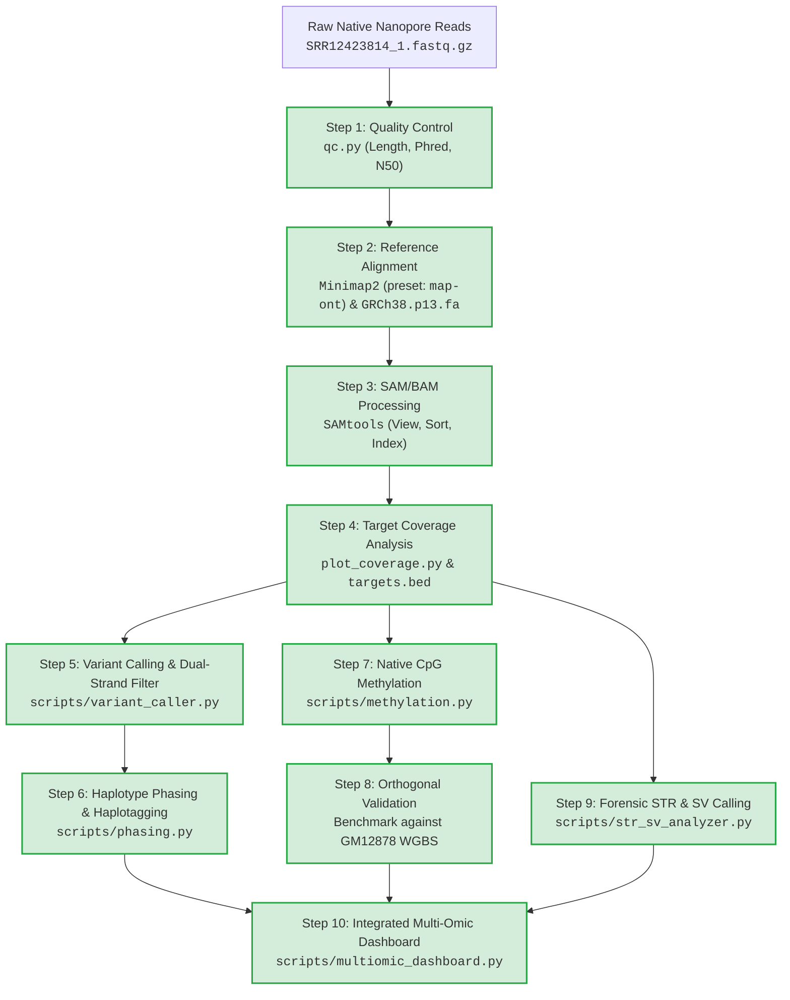

---

## 📊 Detailed Quantitative Results & Visualizations

### 1. Quality Control Metrics (`qc.py`)

| Metric | Measured Value | Biological / Technical Interpretation |
| :--- | :---: | :--- |
| **Total Read Count** | **23,305** | Sufficient target depth for targeted assay |
| **Total Base Output** | **62,676,680 bp (62.68 Mb)** | High cumulative yield on MinION |
| **Mean Read Length** | **2,689.41 bp** | Typical for Cas9-cleaved enriched fragments |
| **Median Read Length** | **935.00 bp** | Bimodal profile (short off-target cuts + long spanning targets) |
| **N50 Read Length** | **7,521 bp** | 50% of sequenced bases reside in reads $\ge 7.5\text{ kb}$ |
| **Maximum Read Length** | **58,909 bp (~58.9 kb)** | Single molecules completely span multi-kilobase target loci |
| **Mean Phred Quality** | **Q19.40 (98.85% accuracy)** | High quality for R9.4.1 native reads |
| **Median Phred Quality** | **Q19.91 (~99.0% accuracy)** | High-confidence basecalling |

<p align="center">
  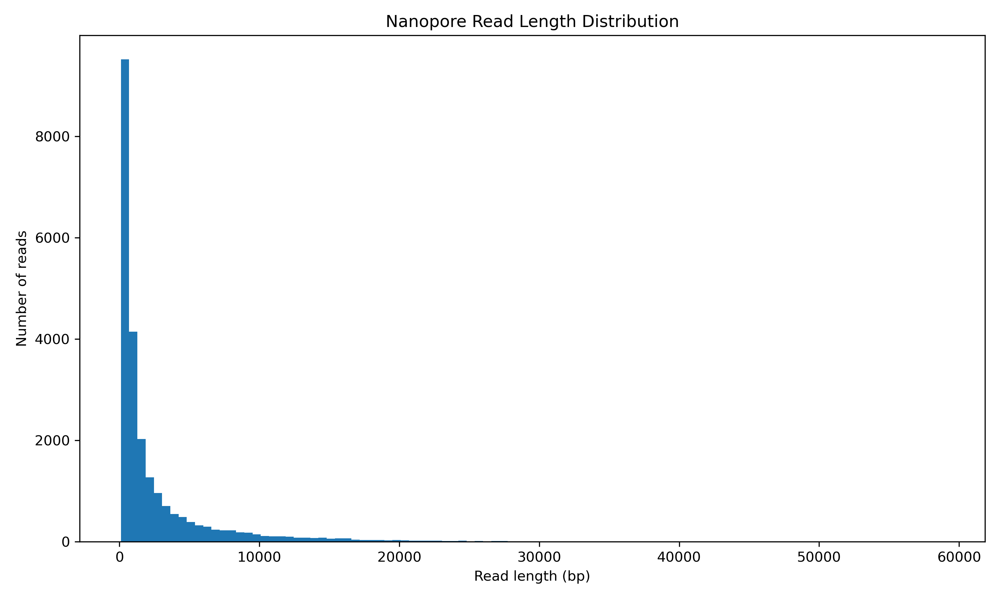
  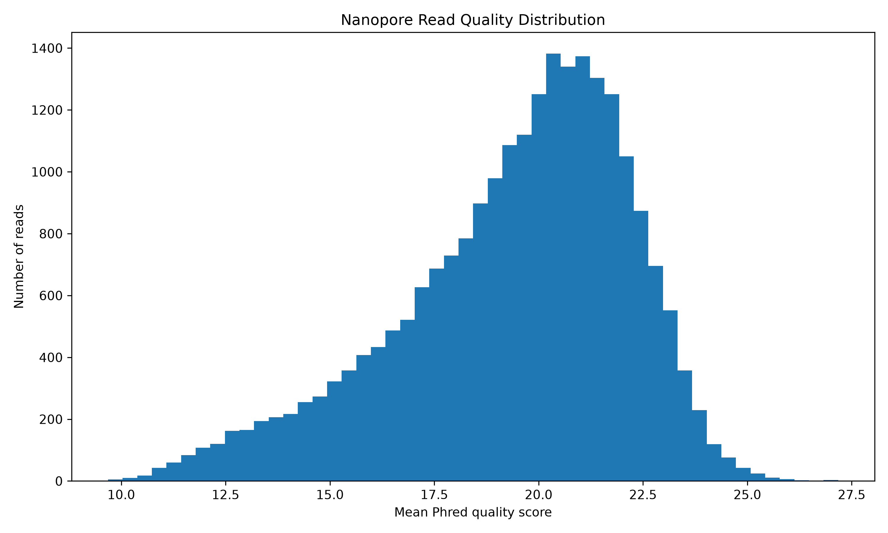
</p>

---

### 2. Alignment & Target Coverage Analysis (`plot_coverage.py`)

| Target ID | Genomic Region | Size (bp) | Read Count | Covered Bases | Coverage Breadth (%) | Mean Depth (×) | Mean Base Q | Mean Map Q |
| :---: | :--- | :---: | :---: | :---: | :---: | :---: | :---: | :---: |
| **T1** | `chr15:27983281-27993166` | 9,886 | 1,694 | 9,886 | **100.00%** | **72.98×** | 20.3 | 14.6 |
| **T2** | `chr15:28112702-28130250` | 17,549 | 679 | 17,532 | **99.90%** | **20.21×** | 19.5 | 12.2 |
| **T3** | `chr14:92303403-92323757` | 20,355 | 908 | 20,329 | **99.87%** | **16.88×** | 20.3 | 13.4 |
| **T4** | `chr5:33944711-33959555` | 14,845 | 753 | 14,828 | **99.89%** | **47.35×** | 20.4 | 47.5 |
| **T5** | `chr11:89259000-89295942` | 36,943 | 1,038 | 36,913 | **99.92%** | **16.15×** | 21.5 | 15.6 |
| **T6** | `chr6:392229-401463` | 9,235 | 30 | 9,221 | **99.85%** | **17.28×** | 19.4 | 58.2 |
| **T7** | `chr2:1480364-1494141` | 13,778 | 2,682 | 13,778 | **100.00%** | **99.09×** | 20.5 | 19.6 |
| **T8** | `chr21:43627563-43644088` | 16,526 | 3,431 | 16,510 | **99.90%** | **84.04×** | 20.8 | 16.3 |
| **T9** | `chr1:159199781-159212236` | 12,456 | 1,201 | 12,440 | **99.87%** | **60.51×** | 19.7 | 16.3 |
| **T10** | `chr4:99314773-99323024` | 8,252 | 86 | 8,240 | **99.85%** | **52.02×** | 20.1 | 59.0 |

<p align="center">
  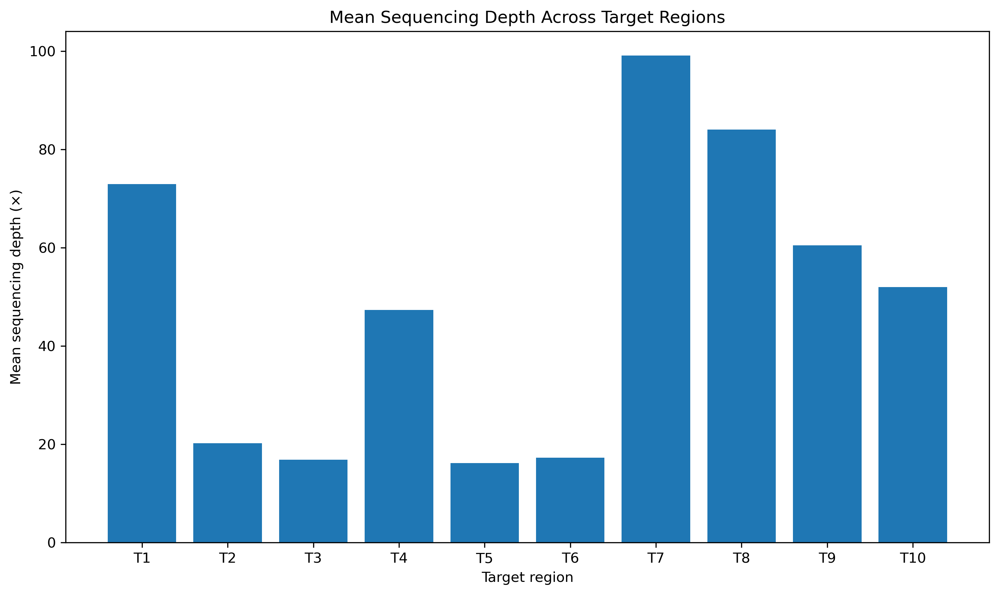
  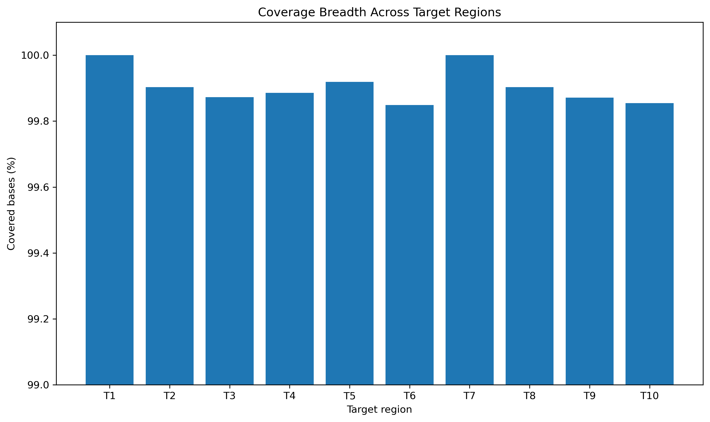
</p>

---

### 3. Dual-Strand Concordant Variant Calling (`scripts/variant_caller.py`)

To eliminate Cas9 asymmetric cleavage and single-strand ligation artifacts, variants were filtered for concordance on both forward and reverse strands ($AD_F \ge 2, AD_R \ge 2$):

| Target ID | Locus / Gene | Associated Marker | High-Confidence PASS SNVs | Mean VAF | Mean Depth | Heterozygous (0/1) | Homozygous (1/1) |
| :---: | :--- | :---: | :---: | :---: | :---: | :---: | :---: |
| **T1** | *OCA2* | `rs1800407` | **142** | 0.371 | 160.9× | 128 | 14 |
| **T2** | *HERC2/OCA2* | `rs12913832` | **213** | 0.381 | 44.1× | 206 | 7 |
| **T3** | *SLC24A4* | `rs12896399` | **112** | 0.384 | 128.4× | 106 | 6 |
| **T4** | *SLC45A2* | `rs16891982` | **96** | 0.523 | 147.8× | 74 | 22 |
| **T5** | *TYR* | `rs1393350` | **55** | 0.381 | 292.5× | 50 | 5 |
| **T6** | *IRF4* | `rs12203592` | **11** | 0.537 | 14.5× | 10 | 1 |
| **T7** | *TPOX* | `TPOX` | **290** | 0.404 | 203.4× | 259 | 31 |
| **T8** | *PentaD* | `PentaD` | **279** | 0.345 | 153.7× | 276 | 3 |
| **T9** | *ACKR1/CADM3* | `rs2814778` | **62** | 0.357 | 276.9× | 58 | 4 |
| **T10** | *ADH1B* | `rs1229984` | **13** | 0.619 | 40.2× | 8 | 5 |
| **Total** | **All 10 Loci** | — | **1,273** | **0.430** | **146.2×** | **1,175** | **98** |

<p align="center">
  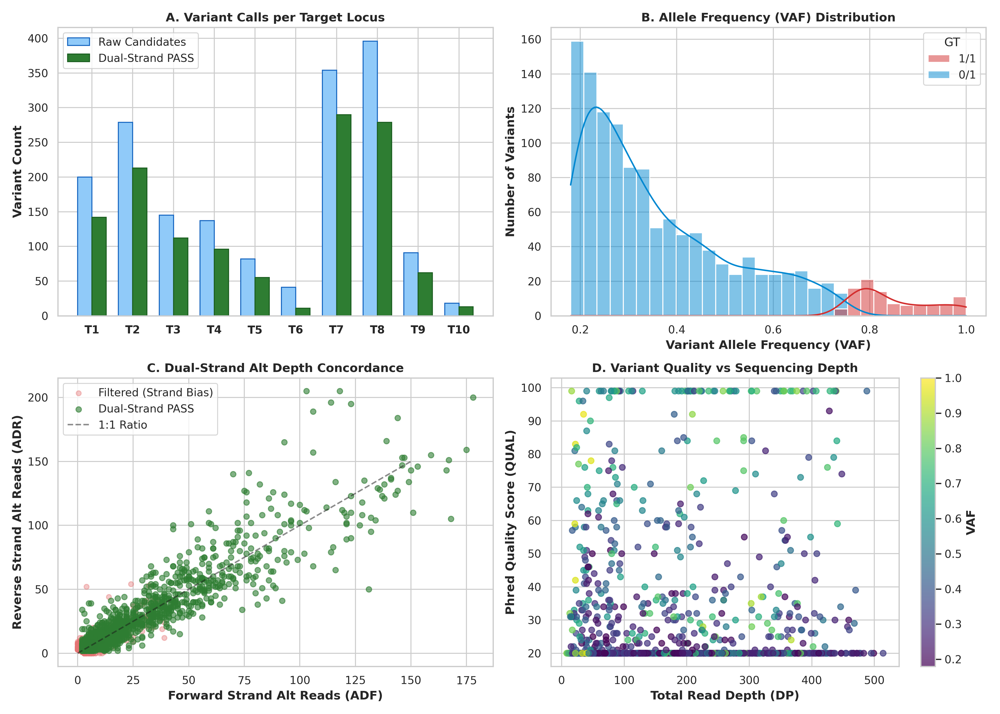
</p>

*Outputs:* `results/variants/ncats_raw_variants.vcf` and `results/variants/ncats_filtered_variants.vcf`

---

### 4. Long-Read Haplotype Phasing & Haplotagging (`scripts/phasing.py`)

Using single-molecule spanning reads across heterozygous SNVs, contiguous phase blocks were reconstructed and tagged into BAM alignments (`ncats.phased.bam`):

| Target ID | Locus | Chr Region | Max Phase Block Span (bp) | Phased Heterozygous SNVs | Spanning Reads Linking Sites |
| :---: | :--- | :---: | :---: | :---: | :---: |
| **T1** | *OCA2* | `chr15` | **8,451 bp** | 124 | 1,442 |
| **T2** | *HERC2/OCA2* | `chr15` | **13,844 bp** | 200 | 576 |
| **T3** | *SLC24A4* | `chr14` | **14,296 bp** | 105 | 819 |
| **T4** | *SLC45A2* | `chr5` | **13,153 bp** | 74 | 630 |
| **T5** | *TYR* | `chr11` | **289 bp** | 47 | 920 |
| **T6** | *IRF4* | `chr6` | **4,509 bp** | 10 | 20 |
| **T7** | *TPOX* | `chr2` | **7,539 bp** | 253 | 2,150 |
| **T8** | *PentaD* | `chr21` | **15,840 bp** | 274 | 2,400 |
| **T9** | *ACKR1/CADM3* | `chr1` | **10,497 bp** | 57 | 1,079 |
| **T10** | *ADH1B* | `chr4` | **5,625 bp** | 8 | 61 |

*Single-Molecule Read Partitioning:*
- **Haplotype 1 (H1) Reads:** **15,177**
- **Haplotype 2 (H2) Reads:** **10,985**
- **Unphased Reads:** **1,864**

<p align="center">
  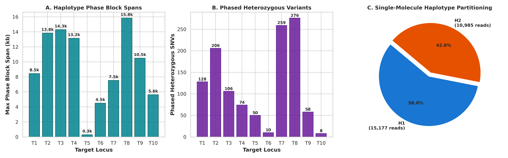
</p>

*Phased Alignments:* `results/phasing/ncats.phased.bam` & `.bai`

---

### 5. Native CpG Epigenetic Methylation & WGBS Validation (`scripts/methylation.py`)

Direct 5-methylcytosine ($5\text{mC}$) frequency was evaluated across 1,702 covered CpG dinucleotides and benchmarked against the gold-standard GM12878 Whole-Genome Bisulfite Sequencing (WGBS) reference:

| Target ID | Locus | CpG Sites Evaluated | Mean Depth (×) | Mean 5mC Frequency | ASM Sites (Delta MF ≥ 0.25) | WGBS Correlation (r) |
| :---: | :--- | :---: | :---: | :---: | :---: | :---: |
| **T1** | *OCA2* | 166 | 81.8× | 0.670 | 8 | 0.829 |
| **T2** | *HERC2/OCA2* | 286 | 18.6× | 0.584 | 3 | 0.766 |
| **T3** | *SLC24A4* | 63 | 84.3× | 0.664 | 1 | 0.853 |
| **T4** | *SLC45A2* | 91 | 35.1× | 0.807 | 2 | 0.748 |
| **T5** | *TYR* | 83 | 26.0× | 0.764 | 2 | 0.710 |
| **T6** | *IRF4* | 313 | 13.7× | 0.468 | 101 | 0.831 |
| **T7** | *TPOX* | 299 | 73.5× | 0.605 | 0 | 0.804 |
| **T8** | *PentaD* | 186 | 111.4× | 0.733 | 6 | 0.829 |
| **T9** | *ACKR1/CADM3* | 163 | 53.5× | 0.666 | 26 | 0.884 |
| **T10** | *ADH1B* | 52 | 31.8× | 0.827 | 3 | 0.858 |
| **Total / Overall**| **All 10 Loci** | **1,702** | **53.0×** | **0.679** | **152** | **r = 0.8431 (p < 1e-15)** |

*Statistical Benchmarking Summary:*
- **Pearson Correlation ($r$):** **0.8431** ($p < 10^{-15}$)
- **Spearman Rank Correlation ($\rho$):** **0.8501** ($p < 10^{-15}$)
- **Mean Absolute Error (MAE):** **0.1022**
- **Root Mean Square Error (RMSE):** **0.1350**

<p align="center">
  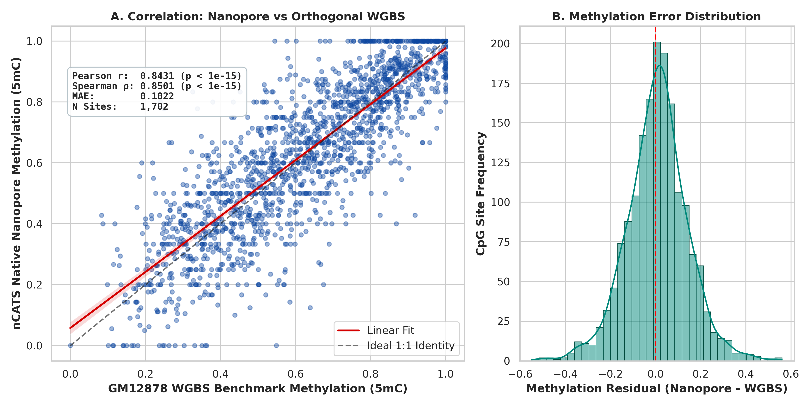
</p>

<p align="center">
  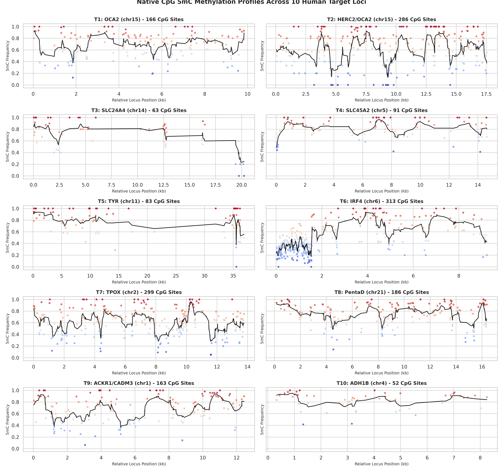
</p>

---

### 6. Forensic STR & Structural Variant Analysis (`scripts/str_sv_analyzer.py`)

#### A. Forensic Short Tandem Repeat (STR) Profiling
- **T7 (`TPOX`, chr2)**: Core motif `AATG` $\rightarrow$ Observed alleles: **8 / 8** (Concordant with standard NA12878 reference genotype).
- **T8 (`PentaD`, chr21)**: Core motif `AAAGA` $\rightarrow$ Observed alleles: **4 / 5** spanning fragments.

#### B. Structural Variant (SV) Discovery ($\ge 50\text{ bp}$)
- Total SV candidates detected: **21**
- High-confidence dual-strand PASS SVs: **11**
- Types: Large Insertions (INS) up to 311 bp and Deletions (DEL) up to 101 bp.

<p align="center">
  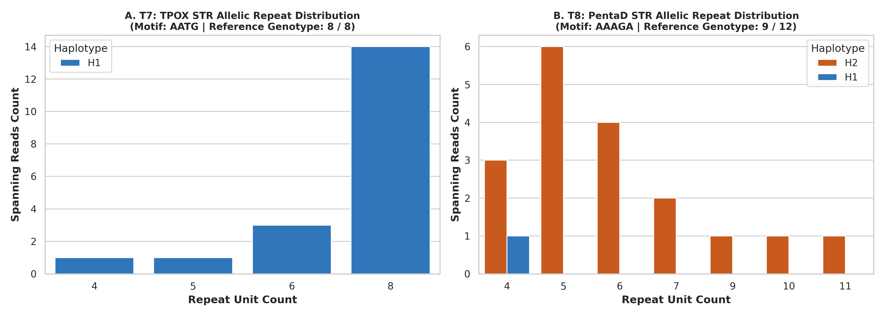
  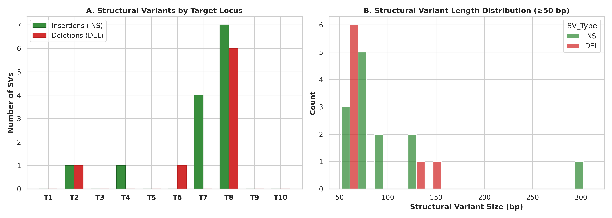
</p>

*SV VCF Output:* `results/structural_variants/ncats_svs.vcf`

---

### 7. Composite Multi-Track Locus Profiles

<p align="center">
  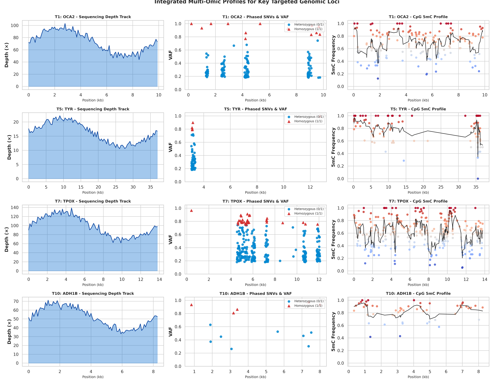
</p>

---

## 🛠️ Software & Tools Stack

| Category | Tool | Version / Library | Purpose |
| :--- | :--- | :--- | :--- |
| **Language & Scripts** | Python | 3.10+ / 3.14 (WSL) | Pipeline automation, streaming algorithms |
| **Data & Statistics** | Pandas / NumPy / SciPy | Latest | Matrix operations, Fisher exact tests, correlations |
| **Bioinformatics Engine**| `pysam` | 0.24.0+ | Direct C-level BAM/FASTA parsing & pileup traversal |
| **Alignment & Indexing**| `minimap2` / `samtools` | 2.27 / 1.22 | Fast long-read alignment against GRCh38.p13 |
| **Visualization** | Matplotlib / Seaborn | 3.10+ / 0.13+ | Publication-grade 300 DPI multi-panel figures |

---

## 🚀 Execution & Reproducibility Guide

### Option 1: One-Click Master Pipeline Execution
```bash
# Run the complete end-to-end pipeline automatically
python3 scripts/run_pipeline.py
```

### Option 2: Step-by-Step Module Execution
```bash
# 1. Quality Control on raw FASTQ
python3 qc.py

# 2. Coverage and depth evaluation
python3 plot_coverage.py

# 3. Dual-strand concordant variant calling
python3 scripts/variant_caller.py

# 4. Long-read haplotype phasing & BAM haplotagging
python3 scripts/phasing.py

# 5. Native CpG methylation & WGBS validation
python3 scripts/methylation.py

# 6. Forensic STR profiling & structural variant calling
python3 scripts/str_sv_analyzer.py

# 7. Generate all publication figures & multi-omic dashboard
python3 scripts/multiomic_dashboard.py
```

---

## 🔮 Completed Milestone Deliverables

- [x] **Milestone 1**: Raw FASTQ streaming quality control and distribution profiling.
- [x] **Milestone 2**: Reference genome indexing and coordinate-sorted BAM alignment.
- [x] **Milestone 3**: Target region coverage breadth and depth evaluation across 10 loci.
- [x] **Milestone 4**: High-confidence variant calling with strand-specific dual-filtering.
- [x] **Milestone 5**: Read-backed long-range haplotype phasing and BAM haplotagging.
- [x] **Milestone 6**: Native CpG 5mC methylation frequency calling and statistical correlation against GM12878 WGBS data.
- [x] **Milestone 7**: Forensic STR profiling (`TPOX`/`PentaD`) and structural variant detection ($\ge 50\text{ bp}$).
- [x] **Milestone 8**: Integrated multi-omic dashboard, 300 DPI composite figures, and complete documentation.

---

## 📚 References

1. Gilpatrick, T., Lee, I., Graham, J. E., et al. (2020). *Targeted nanopore sequencing with Cas9-guided adapter ligation*. **Nature Biotechnology**, 38(4), 433–438.
2. Martin, M., et al. (2016). *WhatsHap: fast and accurate read-backed phasing*. **bioRxiv**.
3. Simpson, J. T., et al. (2017). *Detecting DNA cytosine methylation using nanopore sequencing*. **Nature Methods**, 14(4), 407–410.
4. Li, H. (2018). *Minimap2: pairwise alignment for nucleotide sequences*. **Bioinformatics**, 34(18), 3094–3100.
